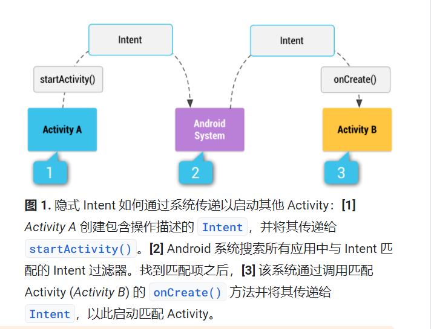

# Intent

## 定义

### 第一行Android代码

`Intent` 是 Android 程序中个组件进行交换的一种重要方式，它不仅可以指明当前组件的要执行的动作，还可以在不同组件之间传递数据。

### Android developers

`Intent`是一个消息传递对象，可以用它来从其他应用组件请求操作

## 基本用例

* 启动 `Activity`    
---------把`Activity`通过`Intent`传递给`startActivity()`  

* 启动 `Service`    
---------通过`Intent` 传递给`startService()`  

* 传递广播

## 类型

* 显式`Intent`  

通过提供相应的软件包名或**完全限定的**组件类名来处理`Intent`  

```
Intent intent = new Intent(FirstActivity.this,SecondActivity.class);
startActivity(Intent);
//Intent(Context packageContxt,Class<?>cls)
```
```
// Executed in an Activity, so 'this' is the Context
// The fileUrl is a string URL, such as "http://www.example.com/image.png"
Intent downloadIntent = new Intent(this, DownloadService.class);
downloadIntent.setData(Uri.parse(fileUrl));
startService(downloadIntent);
```

* 隐式实现Intent  

不指定特定的组件，而是通过更抽象的`action` `category`来交由系统分析`Intent`，并帮我们找出合适的活动并启动  

通过 `<activity>`标签下配置`<Intent-filter>`的内容来指定当前活动能够响应的`action` 和`category`
```
<activity android:name=".SecondActivity">
    <intent-filter>
        <action android:name="com.exmple.activitytest.Action_START" />
        <category android:name="android.intent.category.DEFAULT" />
    <intent-filter>
</activity>

//action 标签中声明了当前活动可以响应 com.exmple.activitytest.Action_START 这个 action,而<category>标签包含了一些附加信息，更精确的指明了Intent中可能带有的 category ,只有两者同时匹配时才能相应
```

```
// Create the text message with a string
Intent sendIntent = new Intent();
sendIntent.setAction(Intent.ACTION_SEND);
sendIntent.putExtra(Intent.EXTRA_TEXT, textMessage);
sendIntent.setType("text/plain");

// Verify that the intent will resolve to an activity
if (sendIntent.resolveActivity(getPackageManager()) != null) {
    startActivity(sendIntent);
}
```


